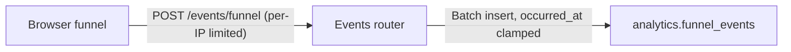

# MR templates

Copy the relevant block and fill every row. A row that does not apply gets `n/a`, never
omission: a missing row reads as an oversight, an explicit `n/a` reads as a decision.

Two formatting rules that are easy to get wrong:

1. **Tables need real headers.** `| | |` renders as an empty header row and looks broken. Use
   `| Field | Value |`.
2. **No em dashes anywhere.** Use a comma, a colon, or parentheses.
3. **Technical terms go in backticks.** `BillingStore.WEB`, `analytics.funnel_events`,
   `occurred_at`, `DOCS_ENABLED`, `CF-Connecting-IP`, `POST /api/v1/events/funnel`, `422`.
   Bare prose for an identifier reads as sloppy and is harder to scan.
4. **Sentence case.** Every bullet and table value opens with a capital. Rephrase rather than
   starting a line with an identifier. Commit subjects stay lowercase; this applies to MR bodies.

## Change MR (anything landing on `staging`)

Scoped to one change and detailed about it. Six labels, assigned to yourself.

**Title:** plain formal English, sentence case, naming what the branch delivers. No emoji, no
type prefix, no scope in parentheses; that grammar is for commits only.

```
Web billing store and funnel event ingestion
Security headers, a private schema, and an edge-trusted client IP
Bound the size of funnel event params
```

````markdown
## Summary

| Field | Value |
|---|---|
| Type | Fix |
| Area | `api` |
| Risk | Rejects a request shape that previously succeeded. Nothing sends one today. |
| Migrations | None |
| Deploy notes | None |
| Rollback | Revert the commit. No migration or data change to unwind. |
| Related | #42, !15 |
| Closes | n/a, see below |

## Problem

Two or three lines on what is wrong or missing, and who it affects. Numbers where they exist:
"8% of scans fail" carries more than "scans sometimes fail".

## Root cause

Required for a `fix/` branch, omitted for a `feat/`. What actually caused it, not what triggered
it. Name the file and line where it lives.

## Changes

- Adds `POST /api/v1/events/funnel`, unauthenticated because the funnel is pre-signup.
- Caps a batch at 100 events and rejects any name outside the allowlist.
- Clamps `occurred_at` to three days either side of receipt.

## Walkthrough



Include a diagram when the change moves data between more than two components. Skip it otherwise.

## Files

<details>
<summary><b>Feature</b> (2 files)</summary>

| File | Change | Lines |
|---|---|---|
| [`app/routers/events.py`](BASE/-/blob/SHA/app/routers/events.py) | Ingest endpoint, per-IP limited | +70/-0 |
| [`app/schemas/analytics.py`](BASE/-/blob/SHA/app/schemas/analytics.py) | Allowlist, batch and size caps | +49/-0 |

</details>

## Verification

- [x] `ruff check` and `npx tsc --noEmit` clean
- [x] Deployed to staging and exercised: `204` on a valid batch, rows in `funnel_events_2026_08`
- [x] Returns `422` on an unknown event name and on a 101-event batch
- [ ] Not verified: behaviour once a row is stranded in the `DEFAULT` partition
````

Two rows people skip and should not:

- **Risk** names the thing that could break and why it does not. "Additive only, no field removed"
  is a fact; "low risk" is an opinion.
- **Rollback** says what to do if this turns out wrong after merge. A revert is fine as an answer;
  "revert plus re-run the previous tag" is a better one; a migration that cannot be undone needs
  saying out loud.

## staging to main (promotion)

Title is `🆕 bump(update): <semver>`. No labels, no assignee.

````markdown
## Release

| Field | Value |
|---|---|
| Version | 1.2.0 |
| Bump | minor (carries a feat) |
| Commits | 3 |
| Diff | 14 files, +377 -0 |
| Migrations | 2 (additive), production moves `c1d2e3f4a5b6` to `f3a4b5c6d7e8` |
| Behaviour change | `/docs` starts returning 404 in production |
| Prerequisite | enum ownership on the app role, applied to both databases |
| Promotes | !14, !15, !17 |
| Closes | #42, #43 (as the line below, which is what actually fires) |

Closes #42, #43

## Changelog

- One flat list, every change, uncategorised, sentence case

## Walkthrough / Files / Verification

Same structure as a feature MR.
````

## Building it

```sh
BASE=$(git remote get-url origin | sed -E 's|^ssh://git@|https://|; s|\.git$||')
SHA=$(git rev-parse origin/staging)

git log --oneline --no-merges origin/main..origin/staging   # commits promoted
git diff --shortstat origin/main...origin/staging           # the Diff row
git diff --numstat  origin/main...origin/staging            # per-file lines
```

Link every file at an immutable SHA rather than a branch name, so the link still shows the
reviewed content after the branch moves on:

```
BASE/-/blob/SHA/path/to/file.py
```

Write the description to a file and pass `--description "$(cat /tmp/mr.md)"`. A heredoc piped
straight into `glab` mangles table pipes and mermaid fences.

## Issue linking

GitLab closes an issue only when the closing pattern reaches the **default branch**, which is
`main`. A change MR targets `staging`, so a closing keyword there renders as a link and then
never fires. That is worse than omitting it, because the issue looks handled and stays open.

| MR | Keyword | Effect |
|---|---|---|
| Change MR, to `staging` | `Related #42` | Links the issue. Nothing closes. |
| Promotion MR, to `main` | `Closes #42` | Closes on merge, because `main` is the default branch. |

**The keyword has to sit on its own line, not in a table cell.** GitLab's closing pattern needs
`Closes` and `#42` separated by nothing but whitespace or a colon, and a table puts a `|` between
them, so `| Closes | #42 |` renders fine and parses as nothing. Keep the row for the reader, and
repeat the keyword as a plain line under the table for GitLab. Verify rather than assume:

```sh
glab api "projects/<ns>%2F<repo>/issues/42/closed_by"   # empty means nothing will close it
```

This was measured, not theorised: a promotion MR whose only `Closes` lived in a table row merged
to `main` and left its issue open.

So the issue closes when the work actually reaches production, which is also when it is true.

Build the promotion's `Closes` row from the MRs being promoted rather than from memory:

```sh
git log --oneline --no-merges origin/main..origin/staging
glab mr list --merged --target-branch staging --per-page 20
```

If there is no issue, write `n/a` rather than dropping the row: a missing row reads as an
oversight, an explicit `n/a` reads as a decision.

## Diagram

Include one when the change moves data between more than two components, or introduces a new
path through the system. Skip it for a rename, a config flip, or a single-file fix: a diagram of
two boxes is noise.

Keep it `flowchart LR`, label the edges with what actually travels, and name real components
rather than architectural layers.
